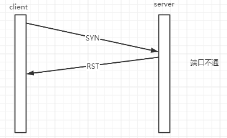

# 0.常见抓包工具

#### <u>[网络工具](https://github.com/sybnfkn/advanced-netty/blob/master/doc/%E5%B8%B8%E8%A7%81%E7%BD%91%E7%BB%9C%E5%B7%A5%E5%85%B7.md)</u>

# 1.bio

####   （1）模拟网络中各种异常（代码中有tcpdump抓包的数据）。

- ##### Connection reset

  ###### 1）<u>[模拟异常代码](https://github.com/sybnfkn/advanced-netty/tree/master/src/main/java/com/zhangyan/bio/rst)</u>

  ###### 2）异常堆栈

  ```java
  java.net.SocketException: Connection reset
  	at java.net.SocketInputStream.read(SocketInputStream.java:210)
  	at java.net.SocketInputStream.read(SocketInputStream.java:141)
  	at java.net.SocketInputStream.read(SocketInputStream.java:127)
  	at com.zhangyan.bio.rst.Server$Task.run(Server.java:60)
  	at java.lang.Thread.run(Thread.java:748)
  ```

  ###### 3）异常产生的原因：

  - 到不存在端口连接请求。

  
  
  - 异常释放一个连接。
  
    正常情况终止连接一方会发送FIN，称为有序释放，正常情况不会有数据丢失。但是有时异常释放，会直接发送一个RST而不是FIN。
  
    
  
  - 检测半打开连接。
  
    如果一方关闭（发送FIN）或者异常关闭（发送RST）而另一方却不知道（可能传输链路上FIN/RST包丢失），这样连接成为半打开连接。
  
    还有可能是客户主机突然断电或者异常关闭，那么服务端是不会主动收到客户机发送关闭的信号包。
  
    此时服务端可能会有很多半打开连接，此时就需要依赖tcp的keepalive或者应用层心跳。如果心跳包到达客户机她不知道报文段中连接。tcp原则就是以RST作为应答。
  
    理论上我们收到FIN正确做法就是close，但是如果我们此时继续write，write到对端，对端就会发回RST。
  
    
  
  ###### 4）tcpdump抓包数据：

```java
10:35:47.911281 IP localhost.58787 > localhost.http-alt: Flags [S], seq 4085467106, win 65535, options [mss 16344,nop,wscale 6,nop,nop,TS val 223620011 ecr 0,sackOK,eol], length 0
10:35:47.911354 IP localhost.http-alt > localhost.58787: Flags [S.], seq 1616411357, ack 4085467107, win 65535, options [mss 16344,nop,wscale 6,nop,nop,TS val 223620011 ecr 223620011,sackOK,eol], length 0
10:35:47.911369 IP localhost.58787 > localhost.http-alt: Flags [.], ack 1, win 6379, options [nop,nop,TS val 223620011 ecr 223620011], length 0
10:35:47.911386 IP localhost.http-alt > localhost.58787: Flags [.], ack 1, win 6379, options [nop,nop,TS val 223620011 ecr 223620011], length 0
10:35:47.914694 IP localhost.http-alt > localhost.58787: Flags [P.], seq 1:2, ack 1, win 6379, options [nop,nop,TS val 223620014 ecr 223620011], length 1: HTTP
10:35:47.914716 IP localhost.58787 > localhost.http-alt: Flags [.], ack 2, win 6379, options [nop,nop,TS val 223620014 ecr 223620014], length 0

10:35:47.915644 IP localhost.58787 > localhost.http-alt: Flags [F.], seq 1, ack 2, win 6379, options [nop,nop,TS val 223620014 ecr 223620014], length 0
10:35:47.915666 IP localhost.http-alt > localhost.58787: Flags [.], ack 2, win 6379, options [nop,nop,TS val 223620014 ecr 223620014], length 0

10:35:48.916008 IP localhost.http-alt > localhost.58787: Flags [P.], seq 2:3, ack 2, win 6379, options [nop,nop,TS val 223621009 ecr 223620014], length 1: HTTP
10:35:48.916066 IP localhost.58787 > localhost.http-alt: Flags [R], seq 4085467108, win 0, length 0
```


- ##### Broken pipe

  ###### 1）<u>[模拟异常代码](https://github.com/sybnfkn/advanced-netty/tree/master/src/main/java/com/zhangyan/bio/broken)</u>

  ###### 2）异常堆栈：

  ```java
  java.net.SocketException: Broken pipe (Write failed)
  	at java.net.SocketOutputStream.socketWrite0(Native Method)
  	at java.net.SocketOutputStream.socketWrite(SocketOutputStream.java:111)
  	at java.net.SocketOutputStream.write(SocketOutputStream.java:134)
  	at com.zhangyan.bio.broken.Server$Task.run(Server.java:79)
  	at java.lang.Thread.run(Thread.java:748)
  ```

  ###### 3）异常产生原因：

  ​		在RST异常基础上。如果继续写数据就会抛出该异常。

  ###### 4）tcpdump抓包数据：

```java
10:44:56.785054 IP localhost.58951 > localhost.http-alt: Flags [S], seq 3781600995, win 65535, options [mss 16344,nop,wscale 6,nop,nop,TS val 224167340 ecr 0,sackOK,eol], length 0
10:44:56.785120 IP localhost.http-alt > localhost.58951: Flags [S.], seq 4178681052, ack 3781600996, win 65535, options [mss 16344,nop,wscale 6,nop,nop,TS val 224167340 ecr 224167340,sackOK,eol], length 0
10:44:56.785158 IP localhost.58951 > localhost.http-alt: Flags [.], ack 1, win 6379, options [nop,nop,TS val 224167340 ecr 224167340], length 0
10:44:56.785172 IP localhost.http-alt > localhost.58951: Flags [.], ack 1, win 6379, options [nop,nop,TS val 224167340 ecr 224167340], length 0
10:44:56.788796 IP localhost.58951 > localhost.http-alt: Flags [P.], seq 1:32, ack 1, win 6379, options [nop,nop,TS val 224167343 ecr 224167340], length 31: HTTP
10:44:56.788820 IP localhost.http-alt > localhost.58951: Flags [.], ack 32, win 6379, options [nop,nop,TS val 224167343 ecr 224167343], length 0
10:44:56.790098 IP localhost.58951 > localhost.http-alt: Flags [F.], seq 32, ack 1, win 6379, options [nop,nop,TS val 224167344 ecr 224167343], length 0
10:44:56.790121 IP localhost.http-alt > localhost.58951: Flags [.], ack 33, win 6379, options [nop,nop,TS val 224167344 ecr 224167344], length 0
10:44:56.790989 IP localhost.http-alt > localhost.58951: Flags [P.], seq 1:2, ack 33, win 6379, options [nop,nop,TS val 224167344 ecr 224167344], length 1: HTTP

10:44:56.791020 IP localhost.58951 > localhost.http-alt: Flags [R], seq 3781601028, win 0, length 0
```


- ##### EOF（不算一种异常）

  ###### 1）<u>[模拟场景的代码](https://github.com/sybnfkn/advanced-netty/tree/master/src/main/java/com/zhangyan/bio/eof)</u>

  

  ###### 2）tcpdump抓包数据：

```java
10:09:11.138687 IP localhost.58450 > localhost.http-alt: Flags [S], seq 2536016985, win 65535, options [mss 16344,nop,wscale 6,nop,nop,TS val 222027782 ecr 0,sackOK,eol], length 0
10:09:11.138761 IP localhost.http-alt > localhost.58450: Flags [S.], seq 1655685196, ack 2536016986, win 65535, options [mss 16344,nop,wscale 6,nop,nop,TS val 222027782 ecr 222027782,sackOK,eol], length 0
10:09:11.138794 IP localhost.58450 > localhost.http-alt: Flags [.], ack 1, win 6379, options [nop,nop,TS val 222027782 ecr 222027782], length 0
10:09:11.138810 IP localhost.http-alt > localhost.58450: Flags [.], ack 1, win 6379, options [nop,nop,TS val 222027782 ecr 222027782], length 0
10:09:11.142852 IP localhost.58450 > localhost.http-alt: Flags [P.], seq 1:12, ack 1, win 6379, options [nop,nop,TS val 222027786 ecr 222027782], length 11: HTTP
10:09:11.142878 IP localhost.http-alt > localhost.58450: Flags [.], ack 12, win 6379, options [nop,nop,TS val 222027786 ecr 222027786], length 0
10:09:11.142956 IP localhost.58450 > localhost.http-alt: Flags [P.], seq 12:23, ack 1, win 6379, options [nop,nop,TS val 222027786 ecr 222027786], length 11: HTTP
10:09:11.142969 IP localhost.http-alt > localhost.58450: Flags [.], ack 23, win 6379, options [nop,nop,TS val 222027786 ecr 222027786], length 0
10:09:11.144122 IP localhost.58450 > localhost.http-alt: Flags [F.], seq 23, ack 1, win 6379, options [nop,nop,TS val 222027787 ecr 222027786], length 0
10:09:11.144147 IP localhost.http-alt > localhost.58450: Flags [.], ack 24, win 6379, options [nop,nop,TS val 222027787 ecr 222027787], length 0
10:09:11.145207 IP localhost.http-alt > localhost.58450: Flags [F.], seq 1, ack 24, win 6379, options [nop,nop,TS val 222027788 ecr 222027787], length 0
10:09:11.145240 IP localhost.58450 > localhost.http-alt: Flags [.], ack 2, win 6379, options [nop,nop,TS val 222027788 ecr 222027788], length 0
```


#### （2）常见socket参数。

- ##### SO_REUSEADDR

  <u>[示例代码](https://github.com/sybnfkn/advanced-netty/tree/master/src/main/java/com/zhangyan/bio/so_reuseaddr)</u>

- ##### SO_LINGER

  <u>[示例代码](https://github.com/sybnfkn/advanced-netty/tree/master/src/main/java/com/zhangyan/bio/so_linger)</u>


#### （3）backlog案例。


# 2.nio
####   （1）完整的nio案例。

####   （2）模拟Reactor模型案例。

# 3.netty
####   （1）完整的netty案例。

####   （2）生产级心跳检测和异常重连。

####   （3）拆包粘包，自定义协议。

####   （4）高水位低水位。

####   （5）Attribution应用。

####   （6）记一次堆外内存泄漏。